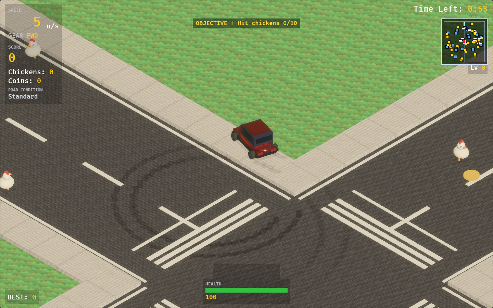

# Roady Car

Roady Car is an isometric arcade driving game built with [Bevy 0.19](https://bevyengine.org/). It runs as a native desktop application or in a WebGL2 browser through WebAssembly.

**Play online:** https://car.segfault.site



The chicken-crossing riddle is reversed: **you are the traffic**. Race through a continuously recycled city, hit wandering chickens for points, collect coins, avoid innocent critters and oncoming cars, and keep the car alive until the clock expires.

> **Controls:** the game supports a desktop keyboard and on-screen touch controls. Touch controls appear after the first touch and are intended for landscape orientation.

## Live leaderboard


The image above is generated from live scores and cached at the edge so README
views do not query the database on every load.

## Gameplay

Each fresh round begins with a 3-2-1 countdown, followed by **60 seconds** of active play.

- Hit chickens to score and keep chaining chicken or coin pickups to build a timed combo multiplier, up to 5x.
- Collect ordinary coins for score and **+1.5 seconds** each (coins cap the clock at 90 seconds; Time power-ups can raise it to the 99-second absolute cap).
- Avoid pedestrians, cows, and moose. Hitting a critter costs health and removes chicken-score points.
- Buildings, roadside obstacles, and moving traffic are solid. Hard impacts damage the car; reaching zero health ends the round.
- Difficulty rises during the round, adding and accelerating oncoming traffic.
- Two deterministic mid-run events temporarily surge traffic, chickens, critters, or combo rewards; banners announce each event.
- Each fresh round assigns a bonus objective—hit chickens, collect coins, or reach a combo tier—for a one-time +10 score reward.
- Power-ups provide speed boost, coin magnet, health recovery, bonus time, or a mega-coin reward.
- The best total score persists between rounds: browser builds use `localStorage`; native builds use `best_score.txt` in the process working directory.

Every new round cycles through one of five road conditions:

1. **Standard** — baseline rules.
2. **Rush Hour** — more, faster traffic.
3. **Chicken Frenzy** — a larger flock and extra chicken points.
4. **Stampede** — more penalty critters.
5. **Glass Cannon** — heavier damage with larger combo bonuses.

## Controls

### Keyboard

| Key | Action |
| --- | --- |
| `Enter` or `Space` | Start from the menu; play again after game over |
| `W` or `↑` | Accelerate |
| `S` or `↓` | Reverse |
| `A` / `D` or `←` / `→` | Steer left / right |
| `Space` | Brake while driving |
| `Shift` | Hold the handbrake to drift through tighter turns and leave tire marks |
| `O` or click/tap `⚙ SETTINGS` | Open Settings from Menu or Pause |
| `Esc` | Pause or resume; return to the menu from game over |
| `R` | Restart from pause or game over |
| `Q` | Return to the menu from pause or game over |
| `M` | Toggle mute |

### Touch controls

On-screen touch controls appear after the first touch and stay available for the rest of the session; landscape orientation is recommended. Touch roles are position-independent:

| Touch | Action |
| --- | --- |
| **1ST TOUCH: DRAG TO DRIVE** | The first eligible live touch anywhere always holds the gas. Drag in any screen direction and the car steers toward that camera-relative direction. |
| **2ND TOUCH: BRAKE / REVERSE** | Any other eligible live touch anywhere brakes at speed >0.15 and holds reverse at speed <=0.15. |

- The direction owner remains fixed while live. A stationary hold still accelerates; movement beyond a small 6px jitter threshold supplies smooth analog steering rather than directional zones. When the owner is released, the remaining eligible touch is promoted to direction and brake/reverse clears if only one touch remains.
- Touches that start inside the top-center **PAUSE** hitbox are excluded from both driving roles. A second touch never changes direction.
- Tap the top-center **PAUSE** button while driving to pause.
- From the menu, tap anywhere to start a round.
- On the pause screen, tap the left third to resume, the middle third to restart, or the right third to return to the menu.
- On the game-over screen, tap the left two-thirds to play again, or the right third to return to the menu.

Mute is available from the touch-accessible Settings panel. Reverse is available by keeping a second eligible touch held through a complete stop.

## Run natively

Install a current stable Rust toolchain, then run the development build:

```sh
cargo run
```

For an optimized native build:

```sh
cargo run --release
```

## Run in a browser

Install the WebAssembly target and [Trunk](https://trunkrs.dev/) once:

```sh
rustup target add wasm32-unknown-unknown
cargo install --locked trunk
```

Start the development server with rebuilds on change:

```sh
trunk serve
```

Then open `http://localhost:8080` if Trunk does not open it automatically.

Create an optimized static web build with the project's size-focused Cargo profile:

```sh
trunk build --release --cargo-profile wasm-release
```

The deployable files are written to `dist/`; serve that directory from an HTTP server rather than opening `index.html` directly.

## Deployment

Production deployment to Cloudflare Pages is configured through GitHub Actions. See [DEPLOYMENT.md](DEPLOYMENT.md) for project creation, credentials, local production builds, deployment, and custom-domain setup.

## Architecture

`src/main.rs` composes the game from focused Bevy plugins:

- `game/` owns states, shared resources and messages, round timing, pause/restart/menu transitions, and fresh-round ordering.
- `car.rs` and `camera.rs` implement arcade driving, collisions, vehicle animation, fixed isometric following, zoom, and impact shake; `touch.rs` adds position-independent touch roles, multi-touch merging, and touch-driven menu/pause/game-over transitions.
- `world.rs` streams the deterministic city grid, roads, buildings, props, obstacles, and coins; `textures.rs` generates tiled surface textures and normal maps.
- `chickens.rs` and `critters.rs` own the wandering targets, hit rules, recycling, models, and particles.
- `combos.rs`, `countdown.rs`, `modifiers.rs`, `difficulty.rs`, `pickups.rs`, and `health.rs` implement round scoring, conditions, traffic, power-ups, and survival systems.
- `ui.rs` provides menu, HUD, pause, and game-over screens; `minimap.rs` provides the pooled radar display.
- `audio.rs` handles effects, engine/ambient loops, and mute state; `persist.rs` stores the best score.
- `effects.rs`, `shaders.rs`, and `transparency.rs` provide pooled tire effects, sky/water and environment lighting, and foreground-building fading.
- `palette.rs` centralizes colors, while `assets/shaders/` contains the small custom WGSL shaders.

Models are built from procedural primitives, and gameplay surface textures are generated at runtime. See [CREDITS.md](CREDITS.md) for the externally sourced environment-map attribution and audio provenance.

## Tests and browser QA

Run the supported formatting and unit-test gates from the repository root:

```sh
cargo fmt --all -- --check
cargo test --locked
cargo check --locked --target wasm32-unknown-unknown
```

Clippy can be run as an advisory check (`cargo clippy --all-targets`), but strict
`-D warnings` is not currently a release gate because Bevy ECS systems trigger
style lints such as type complexity and argument count.

Verify that the optimized browser bundle builds:

```sh
trunk build --release --cargo-profile wasm-release
```

For interactive browser QA, start the development server:

```sh
trunk serve
```

At `http://localhost:8080`, use a desktop keyboard (and, on a touch-enabled device, the on-screen touch controls) and check menu start, the countdown, all driving controls, pause/resume/restart/menu transitions, mute, a full timed round, and browser-console output. Also confirm that the best score and mute preference survive a page reload when browser storage is available.

Automated desktop and touch scenarios are available after serving the game:

```sh
python tools/browser_scenarios.py --url http://localhost:8080
python tools/browser_touch_scenarios.py --url http://localhost:8080
```

## License

Roady Car's original code and assets are released under the [MIT License](LICENSE). Third-party licensing and asset provenance are documented in [CREDITS.md](CREDITS.md).
